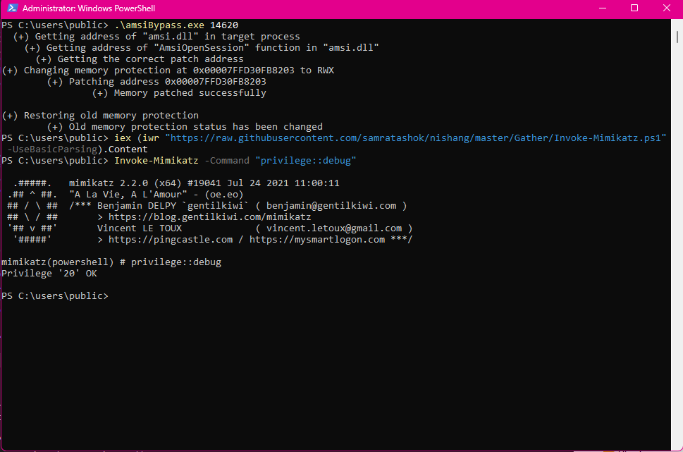

# AMSI-Bypass
This program demonstrates Windows AMSI bypassing via byte patching. This executable enables users to disable AMSI within their current PowerShell session.

# Features
It uses a custom implementation of GetProcAddress to locate the AmsiOpenSession function.

# Usage
This program requires two arguments. The first is the executable name itself, and the second is the PID of the current PowerShell session in which you will run the executable. Run $PID inside your current PowerShell session to retrieve the PID.

